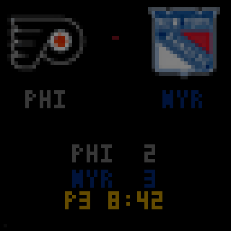
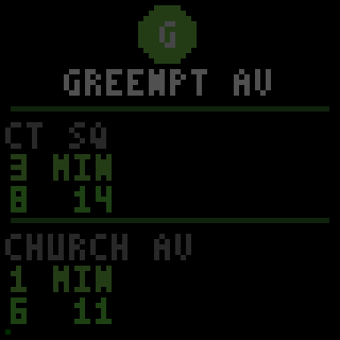
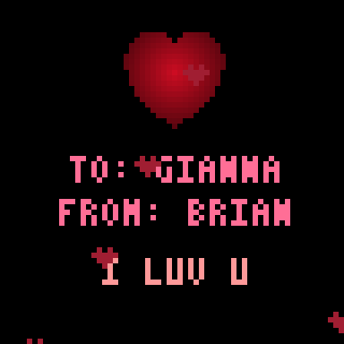
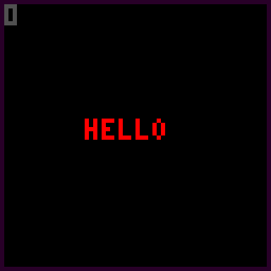
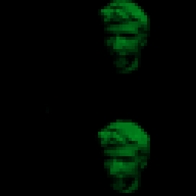
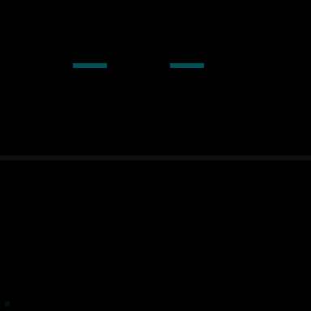
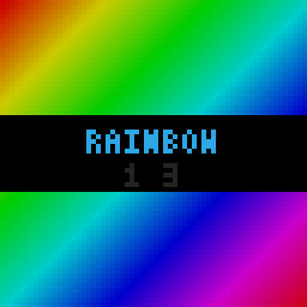

# LED Matrix

A desktop-rendered, WiFi-streamed display system for a 64x64 HUB75 RGB LED matrix powered by an Adafruit MatrixPortal S3.

Write Python apps on your desktop, preview them in a simulator window, and stream the pixels to the board over WiFi in real time.

## Demos

<table>
<tr>
<td align="center">
<br />
<b>Rainbow</b> — Scrolling diagonal color wave
</td>
<td align="center">
<br />
<b>Plasma</b> — Classic demoscene sine plasma
</td>
</tr>
<tr>
<td align="center">
<br />
<b>Sports</b> — Live multi-team scores via ESPN
</td>
<td align="center">
<br />
<b>G Train</b> — Real-time NYC subway arrivals
</td>
</tr>
<tr>
<td align="center">
<br />
<b>Valentine</b> — Pulsing heart with love note
</td>
<td align="center">
<br />
<b>Circle</b> — Breathing color-cycling circle
</td>
</tr>
<tr>
<td align="center">
<br />
<b>Hello</b> — Bouncing text with pulsing border
</td>
<td align="center">
<br />
<b>Caesar</b> — Spinning ASCII 3D cube
</td>
</tr>
<tr>
<td align="center">
<br />
<b>Garvis</b> — Voice assistant face + captions
</td>
<td align="center">
<br />
<b>Chooser</b> — Cycle through all demos
</td>
</tr>
</table>

## Architecture

```
Desktop (Python/pygame)             Board (CircuitPython/ESP32-S3)
┌───────────────────────┐  UDP/WiFi  ┌────────────────────────┐
│  Your App (apps/*.py) │───────────▶│  receiver.py (code.py) │
│  ├─ Canvas API        │  port 7777 │  ├─ WiFi UDP listener  │
│  ├─ Simulator window  │  RGB565    │  ├─ bitmaptools.arrayblit│
│  └─ UDP Sender        │◀──────────│  ├─ HUB75 via rgbmatrix │
└───────────────────────┘  port 7778 │  └─ Button events       │
                           buttons   └────────────────────────┘
```

Apps render to a 64x64 pixel buffer on your desktop. A pygame window shows a 10x upscaled preview. When `MATRIX_IP` is set, each frame is converted to RGB565 and streamed over UDP (one packet per row, 65 packets per frame). The board receives packets directly into a framebuffer bitmap using zero-overhead C-level `memcpy` + `arrayblit` — no per-pixel Python work.

Physical buttons on the board send press events back to the desktop on port 7778, enabling interactive apps.

## Hardware

- [Adafruit MatrixPortal S3](https://www.adafruit.com/product/5778) (ESP32-S3, 8MB flash, 2MB PSRAM, WiFi)
- [64x64 HUB75 RGB LED Matrix](https://www.adafruit.com/product/5362)
- USB-C cable (for programming and power)
- **Important**: Solder the Address E jumper on the MatrixPortal (required for 64-row panels)
- Board runs [CircuitPython 9.2.8](https://circuitpython.org/board/adafruit_matrixportal_s3/)

## Quick Start

### 1. Clone and install

```bash
git clone <this-repo>
cd led-matrix
make setup   # Creates .venv and installs the ledmatrix package
```

### 2. Run a demo in the simulator

```bash
make sim app=apps/rainbow.py
```

A 640x640 pygame window opens showing the 64x64 canvas at 10x scale. Close the window or Ctrl+C to stop.

### 3. Stream to the board

First, deploy the receiver firmware to the board over USB:

```bash
make deploy
```

Then find the board's IP (check serial output):

```bash
make serial
# Look for: "IP: 192.168.x.x"
```

Stream any app to the board:

```bash
make stream app=apps/plasma.py
# or with a custom IP:
MATRIX_IP=192.168.1.100 make stream app=apps/plasma.py
```

### 4. Use the interactive menu

```bash
./run
```

```
  ╔══════════════════════════════════════╗
  ║     LED MATRIX DEMO STORE  64x64     ║
  ╠══════════════════════════════════════╣
  ║  Browse demos. Pick one. Enjoy.      ║
  ╚══════════════════════════════════════╝

  ┌──────────────────────────────────────┐
  │  DEMOS                               │
  ├──────────────────────────────────────┤
  │  1) G Train    Live Greenpoint Ave   │
  │  2) Circle     Pulsing color circle  │
  │  3) Rainbow    Diagonal rainbow wave │
  │  4) Plasma     Demoscene plasma      │
  │  5) Hello      Bouncing text         │
  │  ...                                 │
  └──────────────────────────────────────┘
```

## Writing Your Own App

Create a Python file in `apps/` with a `render()` function:

```python
# apps/myapp.py
from ledmatrix import Canvas, run

def render(canvas: Canvas, t: float, frame: int) -> None:
    """Called every frame. t = seconds elapsed, frame = frame count."""
    canvas.clear()
    canvas.circle(32, 32, int(15 + 8 * __import__('math').sin(t)), Canvas.hsv(t * 60 % 360))
    canvas.text(16, 58, "HELLO", (255, 255, 255))

if __name__ == "__main__":
    run(render, fps=30, title="My App")
```

Run it:

```bash
make sim app=apps/myapp.py          # Simulator only
make stream app=apps/myapp.py       # Simulator + board
```

### Canvas API

```python
canvas.clear(color=(0,0,0))                     # Fill with color
canvas.set(x, y, (r, g, b))                     # Set pixel
canvas.get(x, y) -> (r, g, b)                   # Read pixel
canvas.fill((r, g, b))                           # Fill entire canvas
canvas.rect(x, y, w, h, color, filled=True)      # Rectangle
canvas.line(x0, y0, x1, y1, color)               # Bresenham line
canvas.circle(cx, cy, r, color, filled=False)     # Circle
canvas.text(x, y, "TEXT", color)                  # Built-in 3x5 font

Canvas.hsv(hue, sat=1.0, val=1.0)  # HSV→RGB (hue 0-360)
Canvas.hex(0xFF0000)               # Hex int→RGB tuple
Canvas.rgb(r, g, b)                # Clamped RGB tuple
canvas.get_buffer()                # Raw bytes (12288 bytes, row-major RGB888)
canvas.get_row(y)                  # Raw bytes for one row (192 bytes)
```

The canvas is **not** auto-cleared between frames — your `render()` function has full control.

## Apps

### Generative

| App | Description |
|-----|-------------|
| `rainbow.py` | Full-screen diagonal rainbow gradient that scrolls over time |
| `plasma.py` | Classic demoscene plasma — 4 overlapping sine waves mapped to HSV |
| `circle.py` | A single filled circle that pulses in size and cycles through colors |
| `hello.py` | "HELLO" text bouncing around inside a pulsing magenta border |
| `caesar.py` | ASCII art 3D rotating cube, brightness-mapped to the pixel grid |
| `valentine.py` | Pulsing heart with floating mini-hearts and a love note |

### Live Data

| App | Description | Source |
|-----|-------------|--------|
| `gtrain.py` | NYC G train arrival times for Greenpoint Ave, both directions | MTA GTFS-RT feed |
| `rangers.py` | NY Rangers game status — pre-game, live score, final | ESPN API |
| `sports.py` | Multi-team sports tracker across 15+ leagues with favorites | ESPN API |

### Interactive

| App | Description |
|-----|-------------|
| `chooser.py` | Meta-app that loads all other apps and cycles between them with board buttons or arrow keys |
| `garvis.py` | Voice assistant client — renders animated face and captions, connects to Garvis voice server |

## Garvis Voice Assistant

Garvis is a full voice assistant pipeline that runs on the LED matrix:

```
Microphone → Deepgram STT → LLM (Claude) → ElevenLabs TTS → Speaker
                                    ↓
                        LED Matrix: face + captions
```

The server (`server/garvis_server.py`) handles speech-to-text, LLM conversation, and text-to-speech over a WebSocket. The client (`apps/garvis.py`) captures audio, plays responses, and renders an animated face with eyes, mouth, and word-wrapped captions.

### Setup

```bash
# Install server dependencies
pip install -e ".[server]"

# System dependency (audio decoding)
pacman -S ffmpeg

# Configure API keys in .env
DEEPGRAM_API_KEY=...
ELEVENLABS_API_KEY=...
ANTHROPIC_API_KEY=...
```

### Running

```bash
# Terminal 1: Start the voice server
python server/garvis_server.py

# Terminal 2: Run the client
make stream app=apps/garvis.py

# Or use the interactive menu
./run    # Pick "g" for Garvis server, then run the Garvis client
```

## Make Targets

| Command | Description |
|---------|-------------|
| `make setup` | Create `.venv` and install the package (editable) |
| `make sim app=apps/X.py` | Run an app in the simulator only |
| `make stream app=apps/X.py` | Run with simulator + stream to board |
| `make list` | List available apps |
| `make deploy` | Deploy the UDP receiver to the board as `code.py` |
| `make deploy-file file=board/X.py` | Deploy a specific file as `code.py` |
| `make serial` | Open serial console to the board |
| `make backup` | Backup current CIRCUITPY contents |
| `make mount` | Mount the CIRCUITPY USB drive |

## UDP Protocol

### Pixel Streaming (port 7777, desktop → board)

Each packet is a 2-byte big-endian row number followed by 128 bytes of RGB565 pixel data (64 pixels × 2 bytes, little-endian). A frame-done signal (row `0xFFFF`, no pixel data) triggers `display.refresh()` on the board.

```
┌─────────┬──────────────────────────────────────┐
│ Row (2B) │ 64 pixels × RGB565 (128B)            │
└─────────┴──────────────────────────────────────┘
× 64 rows, then:
┌─────────┐
│ 0xFFFF  │  ← frame done
└─────────┘
```

RGB888 → RGB565 conversion: `((r & 0xF8) << 8) | ((g & 0xFC) << 3) | (b >> 3)`

Rows are sent in bursts of 4 with 4ms pauses to avoid overflowing the board's 6-packet UDP mailbox.

### Button Events (port 7778, board → desktop)

1-byte packets: `0x01` = UP, `0x02` = DOWN. The board debounces at 250ms and sends to the last-seen sender IP.

## Re-recording Demo GIFs

The demo GIFs above are generated headlessly from each app's render function:

```bash
python record_gifs.py
```

This renders frames directly to PIL images (no display needed) and saves animated GIFs to `media/`.

## Troubleshooting

| Problem | Solution |
|---------|----------|
| No `/dev/ttyACM0` | Check `lsusb` for the Adafruit device. Reboot if the kernel was updated. |
| CIRCUITPY won't mount | Double-tap Reset for UF2 bootloader. Or `udisksctl mount -b /dev/sdX1`. |
| Board not receiving pixels | Check serial for IP (`make serial`). Verify same WiFi network. Check firewall on UDP 7777. |
| Wrong colors / garbled display | Verify Address E jumper is soldered. Check `bit_depth` in receiver.py. Check `MATRIX_WIDTH`/`MATRIX_HEIGHT` in board's `settings.toml`. |
| Simulator window won't open | Make sure `pygame-ce` is installed: `pip install pygame-ce` |

## License

MIT
